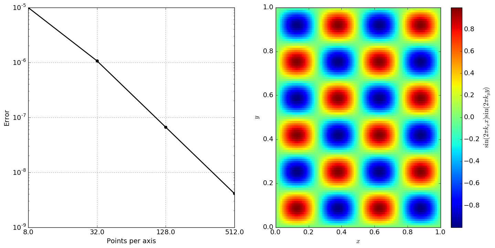

Spiner
===

[](https://www.travis-ci.com/lanl/spiner)

Performance portable utilities for representing and interpolating
tabulated data. Named for [Brent
Spiner](https://en.wikipedia.org/wiki/Brent_Spiner).

## Performance portability

`Spiner` is compatible with code on CPU, GPU, and everything in between. Read the `ports-of-call` [README](ports-of-call/README.md) for more details.

## Installation

`Spiner` is self-contained. Simply clone it as
```bash
git clone git@gitlab.lanl.gov:jonahm/spiner.git
```
If you want to use unit tests, clone with submodules to include `Catch2`.
```bash
git clone --recurse-submodules git@gitlab.lanl.gov:jonahm/spiner.git
```
To build and run unit tests,
```bash
cd test
make test
```
and to do convergence testing,
```bash
cd test
make convergence
```
At the moment, `Spiner` cannot be installed into a system directory.

**Note that you may have to edit the `Makefile` to set paths to, e.g., `hdf5`.**

## Dependencies

`Spiner` has no dependencies for the `databox` tool. Simply include it in your project. It is header-only and requires only a few files:

- `databox.hpp`
- `interpolation.hpp`
- `spiner_types.hpp`
- `sp5.hpp`
- `ports-of-call/portability.hpp`
- `ports-of-call/portable_arrays.hpp`

The testing tooling requires a few different pieces:

- Unit testing requires [Catch2](https://github.com/catchorg/Catch2),
  which is header only. This is included via a git submodule.
- Convergence testing requires the scientific python stack, including:
  - python3
  - numpy
  - matplotlib

### HDF5

`Spiner` supports reading and writing DataBox objects into a custom HDF5 format called `SP5`. 
To enable this, compile with the appropriate `HDF5` linking and the flag `-DSPINER_USE_HDF5`.

### CUDA and Kokkos

`Spiner` uses the `ports-of-call` code to optionally support compilation with CUDA, Kokkos, or none of the above.

## Features

- Spiner supports interpolation in arbitrary dimensions, and it's fast in 3d and fewer.
- Spiner supports interpolation onto "subtables"

## Interpolation

Interpolation is linear. Here's an example of interpolation in 3D (2D
slice shown). Convergence is second-order, as expected.



## Copyright

© (or copyright) 2019-2021. Triad National Security, LLC. All rights
reserved.  This program was produced under U.S. Government contract
89233218CNA000001 for Los Alamos National Laboratory (LANL), which is
operated by Triad National Security, LLC for the U.S.  Department of
Energy/National Nuclear Security Administration. All rights in the
program are reserved by Triad National Security, LLC, and the
U.S. Department of Energy/National Nuclear Security
Administration. The Government is granted for itself and others acting
on its behalf a nonexclusive, paid-up, irrevocable worldwide license
in this material to reproduce, prepare derivative works, distribute
copies to the public, perform publicly and display publicly, and to
permit others to do so.

This program is open source under the BSD-3 License.  Redistribution
and use in source and binary forms, with or without modification, are
permitted provided that the following conditions are met:
1. Redistributions of source code must retain the above copyright
notice, this list of conditions and the following disclaimer.
2. Redistributions in binary form must reproduce the above copyright
notice, this list of conditions and the following disclaimer in the
documentation and/or other materials provided with the distribution.
3. Neither the name of the copyright holder nor the names of its
contributors may be used to endorse or promote products derived from
this software without specific prior written permission.

THIS SOFTWARE IS PROVIDED BY THE COPYRIGHT HOLDERS AND CONTRIBUTORS
"AS IS" AND ANY EXPRESS OR IMPLIED WARRANTIES, INCLUDING, BUT NOT
LIMITED TO, THE IMPLIED WARRANTIES OF MERCHANTABILITY AND FITNESS FOR
A PARTICULAR PURPOSE ARE DISCLAIMED. IN NO EVENT SHALL THE COPYRIGHT
HOLDER OR CONTRIBUTORS BE LIABLE FOR ANY DIRECT, INDIRECT, INCIDENTAL,
SPECIAL, EXEMPLARY, OR CONSEQUENTIAL DAMAGES (INCLUDING, BUT NOT
LIMITED TO, PROCUREMENT OF SUBSTITUTE GOODS OR SERVICES; LOSS OF USE,
DATA, OR PROFITS; OR BUSINESS INTERRUPTION) HOWEVER CAUSED AND ON ANY
THEORY OF LIABILITY, WHETHER IN CONTRACT, STRICT LIABILITY, OR TORT
(INCLUDING NEGLIGENCE OR OTHERWISE) ARISING IN ANY WAY OUT OF THE USE
OF THIS SOFTWARE, EVEN IF ADVISED OF THE POSSIBILITY OF SUCH DAMAGE
